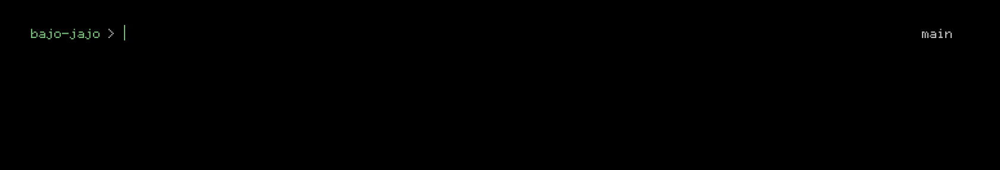
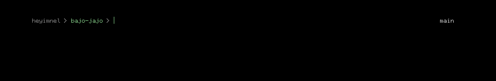

# Minimal OhMyZsh Theme

# Screenshots

### Default


### Hostname


## Installation

1. Clone the theme:
   ```bash
   git clone https://codeberg.org/heyimnel/Minimal-OhMyZsh-Theme.git ~/.oh-my-zsh/custom/themes
   ```

2. Edit `~/.zshrc`:
   ```bash
   nano ~/.zshrc
   ```

3. Set your theme (choose one):
   ```bash
   ZSH_THEME="minimal"          
   ZSH_THEME="minimal-hostname" 
   ```

4. Reload your shell:
   ```bash
   source ~/.zshrc
   ```
